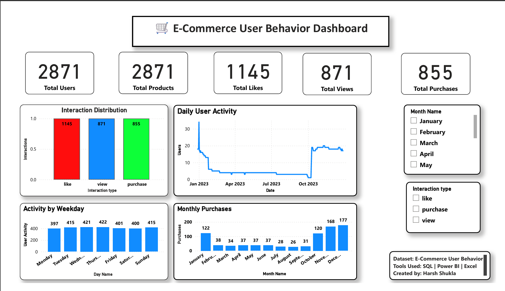

# 🛒 E-Commerce User Behavior Analysis

## 🚀 Project Showcase

📊 Dashboard Screenshot



📄 Power BI Dashboard
- Ecommerce_User_Behavior_Dashboard.pbix

📓 Jupyter Notebook
- notebook/Ecommerce_User_Behavior_Analysis.ipynb

🗃 SQL Queries
 

## Overview

This project analyzes user interaction data (views, likes, and purchases) from an e-commerce platform to understand engagement patterns and identify actionable business insights. The workflow covers the full data analysis pipeline: cleaning raw data in Python, exploring it through 11 business questions in a Jupyter notebook, querying it further with SQL, and presenting the findings in an interactive Power BI dashboard.

---

## 📊 Dashboard Preview


---

## 🗂 Repository Structure

```
ecommerce-user-behavior-analysis-main/
├── Data/
│   ├── E-commerece sales data 2024.csv     # Raw dataset
│   └── cleaned_ecommerce_data.csv          # Cleaned dataset with engineered date/time features
├── notebook/
│   └── Ecommerce_User_Behavior_Analysis.ipynb   # Data cleaning, EDA & visualizations
├── sql/
│   └── analysis.sql                        # SQL queries for business-question analysis
├── dashboard/
│   ├── Ecommerce_User_Behavior_Dashboard.pbix   # Power BI dashboard
│   └── Dashboard.png                       # Dashboard screenshot
└── README.md
```

---

## 🔍 Workflow

**1. Data Cleaning (Python / Pandas)**
- Removed an unnecessary unnamed column, duplicate rows, and missing values
- Converted `user id` to integer and `Time stamp` to proper datetime format
- Engineered new features from the timestamp: `Date`, `Year`, `Month`, `Month Name`, `Day`, `Day Name`, and `Hour`

**2. Exploratory Data Analysis (Jupyter Notebook)**

The notebook works through 11 business questions, each paired with a visualization and a written insight, including:
- Total unique users and products
- Distribution of interaction types (view / like / purchase)
- Most-interacted and most-purchased products
- Most active users
- Activity by month, weekday, and hour of day
- Daily interaction trends over time

**3. SQL Analysis**

`sql/analysis.sql` reproduces and extends the same questions in SQL, including record/user/product counts, top-10 products by purchases/views/likes, interaction percentages, and a `RANK()` window function to rank interaction types.

**4. Power BI Dashboard**

The `.pbix` file brings the analysis together into an interactive dashboard with:
- KPI cards for total users, products, likes, views, and purchases
- Interaction distribution chart
- Daily user activity trend
- Activity by weekday
- Monthly purchases
- Slicers for filtering by month and interaction type

---

## 💡 Key Insights

- Likes are the most frequent interaction type, showing strong product engagement even before a purchase decision.
- A small set of products account for a disproportionate share of views, likes, and purchases, highlighting clear customer favorites.
- User activity is not evenly distributed across the week or the day, pointing to specific windows for marketing and promotions.
- A gap exists between products that are highly viewed/liked and those that are actually purchased, an opportunity for targeted conversion campaigns.

## 📌 Business Recommendations

- Promote products with high engagement but comparatively low purchase rates.
- Reward the most active users through loyalty or referral programs.
- Time marketing campaigns and notifications to align with peak activity days/hours.
- Continuously monitor interaction trends to catch shifts in customer engagement early.

---

## 🛠 Tools Used

| Tool | Purpose |
|---|---|
| Python (Pandas, NumPy, Matplotlib) | Data cleaning, feature engineering, EDA, visualization |
| Jupyter Notebook | Documenting the analysis workflow |
| MySQL | Business-question querying |
| Power BI | Interactive dashboard and reporting |

---

## 🚀 Skills Demonstrated

- Data cleaning & preprocessing
- Feature engineering (date/time features)
- Exploratory data analysis
- SQL querying (aggregation, filtering, window functions)
- Data visualization
- Dashboard design in Power BI

---

## 👨‍💻 Author

**Harsh Shukla**
B.Sc. Information Technology graduate | Aspiring Data Analyst

[GitHub](https://github.com/zzshukla) · [LinkedIn](https://linkedin.com/in/harsh-shukla-739aa52a4)
